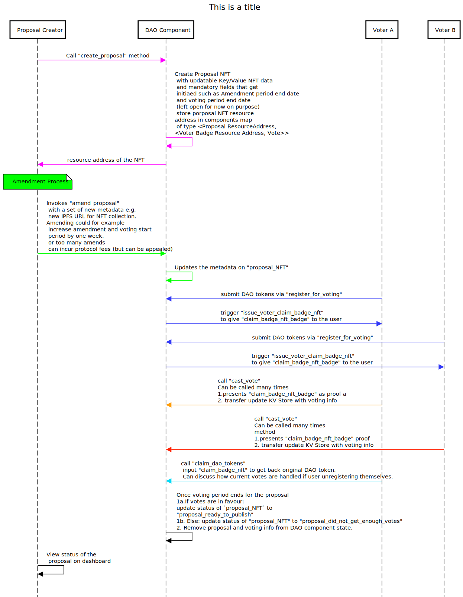

# A Guide to DAO (Decentralized Autonomous Organization)

## High-Level Design Decisions for DAO Radix Components
**WARNING:** This document is a work in progress, and additional decisions may be added in the future.

- DAO designs vary in complexity based on factors such as:
  - `single proposal at a time` vs `multi-proposal at any period of time`: For example, Realm256 voters can choose between voting on a single NFT collection or multiple collections from different authors, provided that the voting periods overlap.
    - `single proposal`:
      - Pros: Simple to implement
      - Cons: Impractical for voters to stay online and vote for each new proposal; a proposal queue becomes necessary.
    - `multiple proposals`:
      - Pros: Voters can vote on multiple proposals as long as the voting period is open.
      - Cons: Must avoid `state explosion` (Subject to discussion: a. Are there that many proposals? b. Do we need to keep a history of which proposal got how much vote forever or can we just remove the proposal key after the voting round finishes? This is to prevent the component state from becoming too large.)
  - `DAO Tokens`:
    - Is it an exclusive token or same as core ecosystem token?
    - Is it limited or unlimited in supply?

      

Decisions made for now:

1. Let's go with the `multiple proposals` design.
2. Voters submit DAO tokens to the DAO Component and receive NFT badge. NFT unique badge address is recorded with vote. So transferring badges between wallets just updates one entry.
 


# Sequence Diagram


## Potential Radix Implementation Pitfalls and Solutions

Documentation Source [Code Hardening](https://docs.radixdlt.com/docs/code-hardening)

### Double Voting / Inflating Voting Weight
From the document:

```
In certain cases, special attention needs to be paid to the use of Proof amounts, especially in the context of applications that rely on such amounts for the casting of votes. Multiple proofs can be created of the same underlying assets.
```

1. Voters can cast votes with a maximum weight equal to the amount of DAO resources (e.g., a governance token) they possess.
2. They can vote for **multiple** proposals.

#### Potential Mishaps

1. If an ordinary proof of the amount of DAO resource is used, they can vote multiple times since, by proof, the tokens are not actually taken away from them.
2. They can create one proof of amount and then call the `vote` method multiple times, thus inflating the weight of their token and voting power.

#### Solution for the Mishap

1. Instead of sending proof of the resource, the voter will send in a bucket containing their DAO resource (e.g., governance token) to be held by the DAO.
2. In return, they will get a claim resource (e.g., a claim NFT or claim fungible tokens) that allows them to recast their vote (during the voting open period) and claim their DAO resource when the voting period is closed.

Refer to the code examples for both correct and incorrect DAO configurations.

### State Explosion

Documentation Source [Code Hardening](https://docs.radixdlt.com/docs/code-hardening)